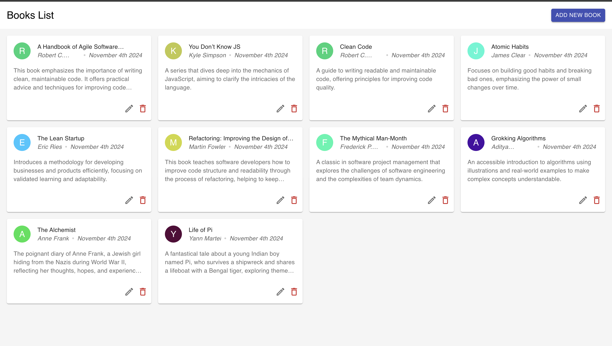

# Book Listing Page

## Overview

This application is a **Book Listing Page** built with **TypeScript**, **React**, and **Jest** for testing. Users can view, create, update, and delete books, and the application uses local storage for data persistence.



## Features

- **View Books**: Display a list of books with details including:
  - Title
  - Author
  - Description
- **Create Book**: Add a new book using a form that collects:
  - Title
  - Author
  - Description
- **Update Book**: Modify the details of an existing book.
- **Delete Book**: Remove a book from the list.

## Technologies Used

- **TypeScript**: For static type checking and enhancing code quality.
- **React**: For building the user interface.
- **Jest**: For testing the components and functionalities of the application.

## Getting Started

To run the application locally, follow these steps:

### Prerequisites

- Node.js (version 12 or higher)
- npm (Node Package Manager)

### Installation

1. Clone the repository:
   ```bash
   git clone <repository-url>
   cd book-listing-page
2. Install the dependencies:
   ```bash
   npm install
3. To start the development server, run:
   ```bash
   npm start
4. To run the unit tests, execute:
   ```bash
   npm test -- --coverage --coveragePathIgnorePatterns="src/context" --coveragePathIgnorePatterns="src/app" --coveragePathIgnorePatterns="src/types"
