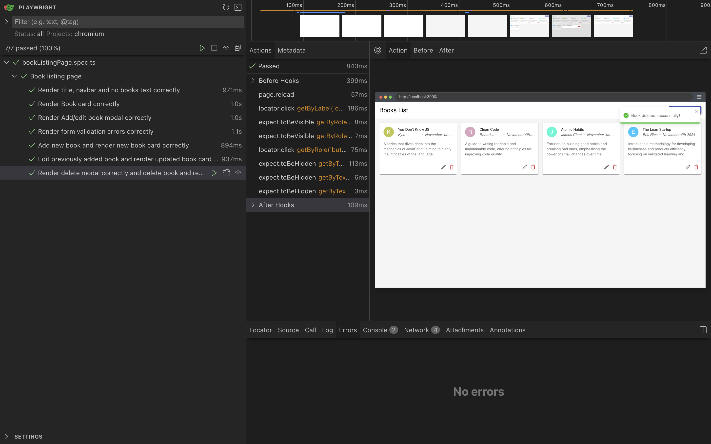

# Book Listing Page

## Overview

This application is a **Book Listing Page** built with **TypeScript**, **React**, and **Jest** for testing. Users can view, create, update, and delete books, and the application uses local storage for data persistence.




## Features

- **View Books**: Display a list of books with details including:
  - Title
  - Author
  - Description
- **Create Book**: Add a new book using a form that collects:
  - Title
  - Author
  - Description
- **Update Book**: Modify the details of an existing book.
- **Delete Book**: Remove a book from the list.

## Technologies Used

- **TypeScript**: For static type checking and enhancing code quality.
- **React**: For building the user interface.
- **Jest**: For testing the components and functionalities of the application.

## Getting Started

To run the application locally, follow these steps:

### Prerequisites

- Node.js (version 12 or higher)
- npm (Node Package Manager)

### Installation

1. Clone the repository:
   ```bash
   git clone <repository-url>
   cd book-listing-page
2. Install the dependencies:
   ```bash
   npm install
3. To start the development server, run:
   ```bash
   npm start
4. To run the unit tests, execute:
   ```bash
   npm test -- --coverage --watchAll
4. To run the end-to-end tests using playwright, execute:
   ```bash
   npx playwright test --ui

### Test Coverage

File                             | % Stmts | % Branch | % Funcs | % Lines | Uncovered Line #s 
---------------------------------|---------|----------|---------|---------|-------------------
All files                        |   97.97 |    95.04 |     100 |   97.84 |                   
 components/ui                   |     100 |    94.73 |     100 |     100 |                   
  CustomButton.tsx               |     100 |      100 |     100 |     100 |                   
  CustomModal.tsx                |     100 |    95.83 |     100 |     100 | 51                
  DividerDot.tsx                 |     100 |      100 |     100 |     100 |                   
  TextInput.tsx                  |     100 |     87.5 |     100 |     100 | 25                
 constants                       |     100 |      100 |     100 |     100 |                   
  mock.ts                        |     100 |      100 |     100 |     100 |                   
 features/addEditBook            |     100 |      100 |     100 |     100 |                   
  index.tsx                      |     100 |      100 |     100 |     100 |                   
 features/addEditBook/components |     100 |      100 |     100 |     100 |                   
  AddEditBookModal.tsx           |     100 |      100 |     100 |     100 |                   
 features/addEditBook/forms      |     100 |      100 |     100 |     100 |                   
  AddEditBookForm.tsx            |     100 |      100 |     100 |     100 |                   
  validation.ts                  |     100 |      100 |     100 |     100 |                   
 features/deleteBook/components  |     100 |      100 |     100 |     100 |                   
  DeleteModal.tsx                |     100 |      100 |     100 |     100 |                   
 features/listBooks              |     100 |       80 |     100 |     100 |                   
  index.tsx                      |     100 |       80 |     100 |     100 | 9                 
 features/listBooks/components   |     100 |      100 |     100 |     100 |                   
  BookCard.tsx                   |     100 |      100 |     100 |     100 |                   
  NoBooksFound.tsx               |     100 |      100 |     100 |     100 |                   
 lib                             |   95.65 |    91.66 |     100 |   95.34 |                   
  storage.ts                     |     100 |      100 |     100 |     100 |                   
  utils.ts                       |   94.11 |    88.88 |     100 |   93.54 | 39,88             

